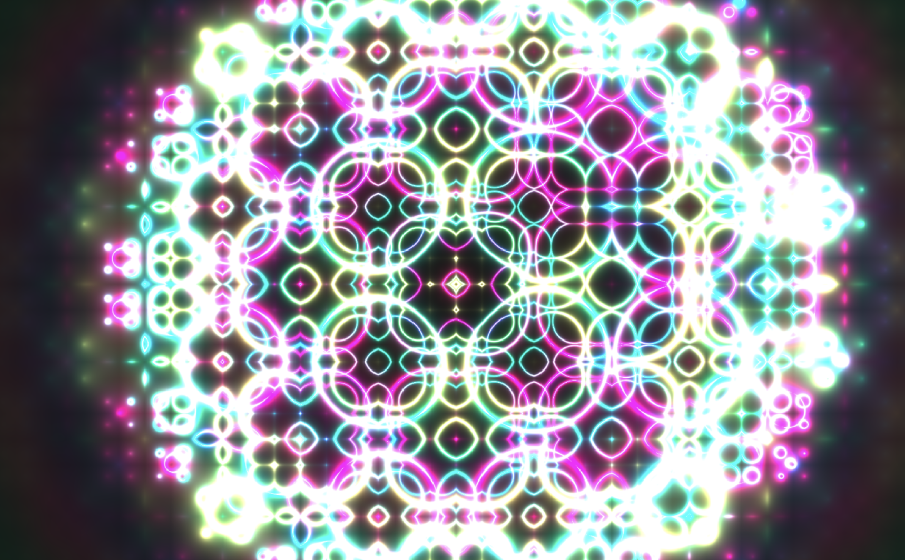

# Fractal Celestial Shader

Animated celestial scene built from fractal repetition, signed distance fields, and smooth blending.

## Summary
This final project combines procedural fractal structure with SDF primitives to create a layered animated scene.

## Tech Stack
- GLSL fragment shader development
- C++ and OpenGL-style rendering setup
- Procedural color and distance-field techniques

## Overview
- Normalized screen-space coordinates with zoom control through `u_zoom`
- Fractal repetition and warped UVs for layered motion
- SDF primitives including moon, star, and capsule shapes
- Smooth minimum blending to merge forms into a single organic composition
- Phase-shifted cosine color palettes for animated gradients

## Interaction
- Press `x` to zoom in
- Press `z` to zoom out

## Notes
- The scene combines fractal structure with SDF shape composition.
- Distance-field blending and iterative distortion create the evolving visual pattern.
- The final effect emphasizes smooth transitions, motion, and color variation.

## Reflection
- The project matched the original proposal and was completed as planned.
- I added keyboard-based zoom controls to explore the fractal in more detail.
- The main technical takeaway was how small changes in SDF blending can produce very different visual results.

## Video
- https://youtu.be/whBVdz9iIxc
