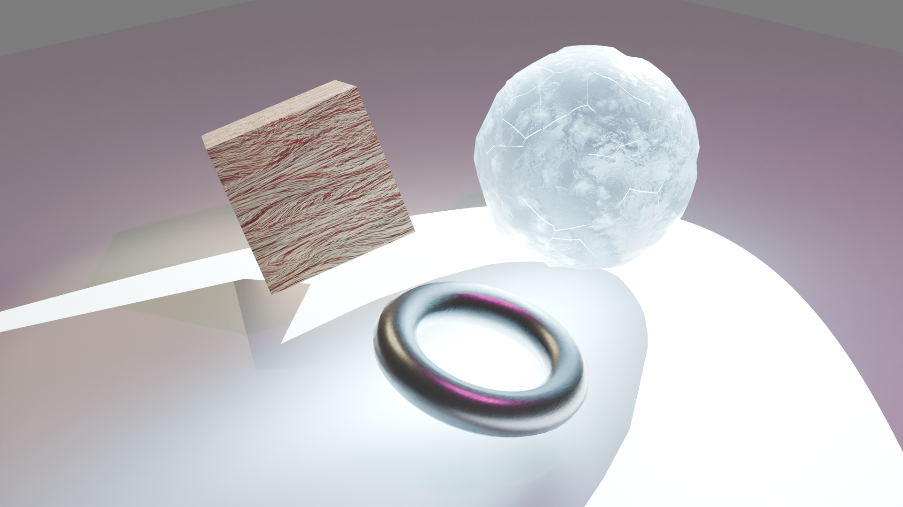

# Ray Tracing in Blender Cycles

## Overview
Ray tracing is a rendering technique that simulates realistic lighting behavior by tracing rays from the camera through each pixel in a scene. These rays intersect with geometry, bounce recursively to calculate reflections, refractions, shadows, and caustics, and ultimately produce physically accurate visual results.

In this Blender Cycles scene, ray tracing allows for realistic effects such as:
- **Light bending through ice**, forming bright caustic patterns on the floor.  
- **Sharp metallic reflections** capturing colored lights with precision.  
- **Soft multi-source shadows** that interact across surfaces.

**Figure 2:** second render attempt.

***

## Geometry Choices
- **Cube:** Smooth surfaces with sharp creases demonstrate how ray tracing handles crisp edges and shadow transitions.  
- **Bumpy Sphere:** Noise-displaced surface details highlight dynamic light behavior across varied microfacets.  
- **Torus:** The curved and hollow structure showcases self-shadowing and light occlusion accuracy.

***

## Material Choices
- **Wood Cube:** Procedural diffuse texture with roughness = 0.4, creating subtle scattering and gloss.  
- **Ice Sphere:** Fully transmissive material (Transmission = 1.0) with a blue tint, low roughness, and Voronoi normal mapping for realistic refraction and inner glow.  
- **Brushed Chrome Torus:** Metallic value of 1.0 and low roughness for crisp reflections of lights and surrounding objects.

***

## Lighting Setup
- **Pink Point Light:** Adds omnidirectional, colored illumination, contributing to tinted shadow edges.  
- **Yellow Spot Light:** Positioned diagonally overhead to cast warm highlights on the torus and cube.  
- **White Spot Light:** Focused through the ice sphere; wattage varied between renders to study caustic intensity.

***

## Shadows and Caustics

**Figure 1:** First render attempt.

- **Figure 1 (Initial Render):**  
  - Spotlight power: 10,000 W  
  - Caustics: *Disabled*  
  - Result: Overexposed highlights, low detail in bright areas.

- **Figure 2 (Refined Render):**  
  - Spotlight power: 900 W  
  - Caustics: *Enabled* (`Cast Shadow Caustics` on ice sphere, `Receive Shadow Caustics` on floor plane)  
  - Result: Dimmer ice glow with clearer refracted caustic streaks on the floor. The torus shadow intersects the caustics, demonstrating realistic light occlusion and focusing.

***

## References
- **Wood Material:** [Procedural Wood Material Guide](https://medium.com/@samuelsullins/make-this-easy-procedural-wood-material-in-blender-with-just-10-nodes-c94a3f8b54ad)  
- **Ice Material:** [YouTube Tutorial](https://www.youtube.com/watch?v=8BD6C33g0VE)
