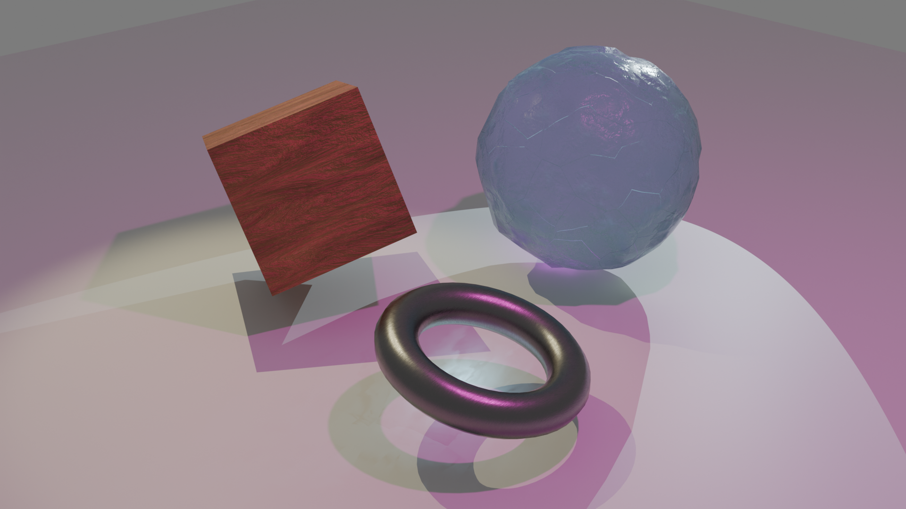

# Ray Tracing in Blender Cycles

Blender Cycles scene focused on realistic lighting, reflections, refractions, and caustics.

## Summary
This scene explores how ray tracing handles physically based lighting, reflective materials, and caustic effects across a simple object set.

## Tech Stack
- Blender Cycles
- Ray tracing and physically based shading
- Procedural materials and lighting setup

## Overview
Ray tracing simulates lighting by tracing rays through a scene and recursively evaluating reflections, refractions, shadows, and caustics.

The scene demonstrates:
- Light bending through ice, forming bright caustic patterns on the floor
- Sharp metallic reflections capturing colored lights with precision
- Soft multi-source shadows that interact across surfaces

## Scene Elements
- **Cube:** Smooth surfaces with sharp creases for crisp edge handling
- **Bumpy Sphere:** Noise-displaced surface detail for varied microfacet lighting
- **Torus:** Curved, hollow geometry for self-shadowing and light occlusion

## Materials
- **Wood Cube:** Procedural diffuse texture with moderate roughness
- **Ice Sphere:** Transmissive material with blue tint, low roughness, and Voronoi normal mapping
- **Brushed Chrome Torus:** Metallic material with low roughness for clean reflections

## Lighting
- **Pink Point Light:** Adds omnidirectional colored illumination
- **Yellow Spot Light:** Casts warm highlights from above
- **White Spot Light:** Drives the ice caustics and is tuned across renders

## Render Comparison
**Initial render:** Overexposed highlights with caustics disabled.

**Refined render:** Lower spotlight power with caustics enabled on the ice sphere and floor plane, producing clearer refracted light streaks.

## References
- [Procedural Wood Material Guide](https://medium.com/@samuelsullins/make-this-easy-procedural-wood-material-in-blender-with-just-10-nodes-c94a3f8b54ad)
- [YouTube Tutorial](https://www.youtube.com/watch?v=8BD6C33g0VE)
